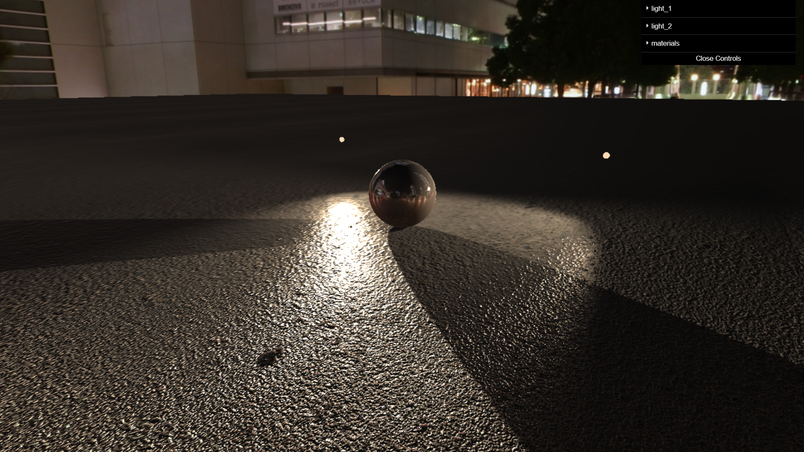

# Rendered result

# Install packages
`npm install`

# Run dev server
`npx vite`

# File structure
## main.js
This file animates a scene. To run this file instead, go to index.html and replace main2.js with main.js.

## main2.js (default)
THis file draw map onto object.